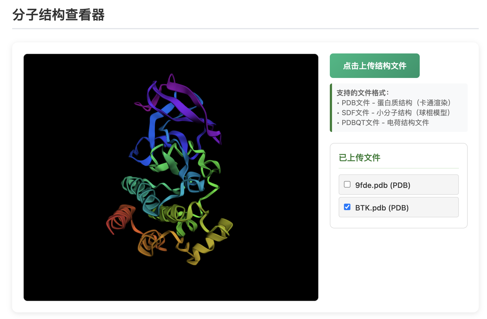
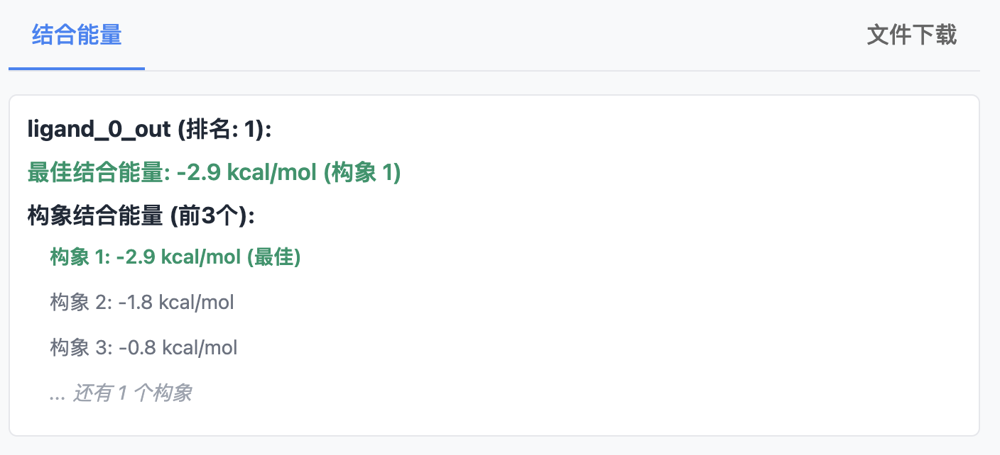

## autodock

### 介绍

AutoDock是一款广泛应用于分子对接的开源工具套件，由Scripps研究所开发，主要用于预测小分子配体与生物大分子（如蛋白质）之间的结合模式和亲和力。

其核心算法结合了拉马克遗传算法和半柔性对接策略，支持配体构象搜索和蛋白质侧链柔性调整。AutoDock Vina作为其优化版本，在速度和精度上显著提升，采用梯度优化算法实现高效全局搜索。用户需准备受体（PDBQT格式）和配体文件，通过定义搜索空间生成结合构象及结合自由能评分。该工具广泛应用于药物虚拟筛选和相互作用机制研究。

### 输入

上传文件结构包括：
##### PDB文件（蛋白质结构）
PDB（Protein Data Bank）格式是存储生物大分子三维结构的标准文本格式，由固定列宽的记录行组成，包含原子坐标、残基信息、二级结构等关键数据。每行以特定关键字（如ATOM、HETATM）开头，记录原子序号、元素类型、残基名称、链标识、三维坐标（X/Y/Z）及温度因子等信息。该格式兼容主流可视化工具（PyMOL、Chimera），但精度受限于列宽限制（坐标保留3位小数）

PDB文件可直接从RCSB数据库下载，是分子对接、结构分析的基础输入格式。

##### SDF文件（小分子结构）
SDF（Structure-Data File）是一种化学信息学通用格式，以文本形式存储单/多分子的结构、属性及拓扑信息。每个分子由原子-键列表（如`C 1.0 0.0 0.0`）、连接性（`1 2 1`）及自定义属性（如`> <IC50>`）组成，支持多分子批量存储（通过`$$$$`分隔）。SDF广泛用于药物数据库（如PubChem）和虚拟筛选，其优势在于兼容生物活性数据，但需工具（如OpenBabel）转换为PDBQT等对接专用格式。

##### PDBQT文件
电荷结构文件，包含蛋白质或者小分子结构信息，既可以通过**PDB**文件转化生成，也可以从**SDF**等小分子格式转换得到

PDBQT是AutoDock系列工具专用的分子格式，在PDB基础上扩展了原子电荷（Q）、原子类型（T）及柔性定义。受体PDBQT需保留蛋白质刚性骨架并指定柔性残基（如`REMARK 20 active torsions`），配体PDBQT则需标记可旋转键（`TORSDOF 10`）。该格式通过工具（如MGLTools）从PDB/SDF生成，关键步骤包括：加氢（如`pdbqt_addh`）、计算电荷（如Gasteiger）、删除非极性氢，确保对接时能量评分准确。PDBQT是AutoDock/Vina强制要求的输入格式，平衡了结构精度与计算效率。

##### 坐标选择

可通过在查看器中选择原子进行手动坐标查询及显示，后续可以讲坐标填入对接参数窗口中

### 参数调整

##### 口袋中心坐标

在AutoDock中，口袋中心坐标（Grid Center）用于定义分子对接的搜索空间核心位置，通常以三维直角坐标系（X、Y、Z）表示。这些坐标需精准覆盖目标蛋白的活性位点或已知结合区域，可通过可视化软件（如PyMOL）手动测量或基于参考配体的质心自动计算。

若坐标过于偏离实际结合位点，可能导致对接失败或结果不准确。例如，对HIV-1蛋白酶，中心坐标可能设为关键催化残基（如Asp25）附近。用户需在配置文件（.gpf或Vina的--center参数）中指定位置，确保算法聚焦于相关区域。

##### 对接盒子尺寸

对接盒子尺寸（Grid Box Size）决定了搜索空间的范围，以埃（Å）为单位定义长、宽、高（如20×20×20 Å）。尺寸过小可能遗漏潜在结合位点，过大则增加计算量且降低精度。

一般建议盒子边缘距离配体至少5-10 Å，以容纳构象变化。例如，若配体大小约10 Å，盒子尺寸可设为20×20×20 Å。在柔性对接中，还需考虑蛋白质侧链运动空间。AutoDock Tools或Vina的--size参数可交互式调整盒子，需平衡计算效率与覆盖度。

##### 计算线程数

计算线程数（Number of Threads）控制并行计算资源，直接影响对接速度。AutoDock Vina通过--cpu参数指定（如--cpu 8表示使用8线程），充分利用多核CPU加速搜索。目前平台推荐线程数值：2000-5000

### 输出结果

结合能量窗口中显示不同构象的结合能排名，可以初步筛选底物与酶的耦合效果。通过比较不同底物的结合能，有效评估其与受体的相互作用强度。
结合能单位通常为负值，单位kcal/mol，负值越大结合能越高。通过结合能在下载文件中找到对应的构象并转换为PDB格式
