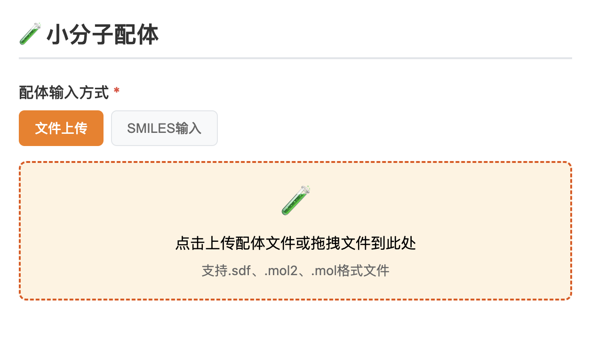

## diffdock

### 介绍

DiffDock是一种基于扩散模型的革命性分子对接方法，通过先进的生成式AI技术预测小分子配体与蛋白质受体的结合模式。

与传统依赖力场和采样算法的对接工具不同，DiffDock利用扩散模型的强大生成能力，将对接过程转化为从噪声中逐步重建配体三维姿态的概率建模问题。该方法首先生成随机初始构象，然后通过训练好的神经网络逐步去噪，最终输出高精度的结合构象，同时为每个预测提供置信度评分。

DiffDock的创新性在于其能够自然处理蛋白质-配体相互作用中的复杂特性，如蛋白质柔性、诱导契合效应和隐式结合口袋，而无需预先定义搜索空间或依赖经验力场。相比传统方法，DiffDock在对接精度上显著提升，特别是对于困难靶点，其预测结果中高精度构象（RMSD≤2Å）的比例可达60-80%，远超传统方法的30-50%。

此外，DiffDock的计算效率极高，在GPU上可实现秒级预测，支持大规模虚拟筛选。该方法的输出包含多个可能构象及其置信度，用户可根据需求筛选最优结果或分析结合模式的多模态分布。DiffDock的出现为药物发现中的分子对接提供了全新范式，适用于挑战性靶点的先导化合物优化和虚拟筛选研究。

### 输入

#### 蛋白质输入

**蛋白质输入格式： PDB**
PDB（Protein Data Bank）格式是存储生物大分子三维结构的标准文本格式，由固定列宽的记录行组成，包含原子坐标、残基信息、二级结构等关键数据。每行以特定关键字（如ATOM、HETATM）开头，记录原子序号、元素类型、残基名称、链标识、三维坐标（X/Y/Z）及温度因子等信息。该格式兼容主流可视化工具（PyMOL、Chimera），但精度受限于列宽限制（坐标保留3位小数）

PDB文件可直接从RCSB数据库下载，是分子对接、结构分析的基础输入格式。

#### 小分子输入

SDF（Structure-Data File）、MOL2（Tripos Mol2）和MOL（MDL Molfile）是化学信息学和分子建模中广泛使用的配体文件格式，它们的来源和发展背景各不相同：

1. **SDF（Structure-Data File）**
    
    - **来源**：由**MDL Information Systems**（现属Biovia/Dassault Systèmes）开发，最初用于其分子建模软件（如ISIS/Draw、Pipeline Pilot）8。
        
    - **特点**：支持存储多个分子结构及自定义属性（如生物活性数据），广泛应用于高通量虚拟筛选和药物数据库（如PubChem、ChEMBL）8。
        
2. **MOL2（Tripos Mol2）**
    
    - **来源**：由**Tripos Associates**（现属Certara）为其**SYBYL**分子建模软件设计，用于存储分子结构、电荷、力场参数等扩展信息36。
        
    - **特点**：采用自由格式ASCII文本，支持复杂分子描述（如蛋白质-配体相互作用），常见于分子动力学模拟（如AMBER、GROMACS）3。
        
3. **MOL（MDL Molfile）**
    
    - **来源**：由**MDL**开发，是早期化学信息学的标准格式，用于单分子结构存储8。
        
    - **特点**：结构简单，仅包含原子、键和基本连接性数据，兼容大多数化学绘图工具（如ChemDraw）
    
4. **SMILES**（Simplified Molecular Input Line Entry System）描述分子结构的字符串

### 参数调整

DiffDock中的采样数量（num_samples）是指模型在预测时生成的候选结合构象总数，直接影响结果的全面性和计算效率。增加采样数（如>20）能提高对柔性配体或复杂结合位点的覆盖度，更可能捕获真实构象，但会显著增加计算时间和GPU内存消耗；减少采样数（如<20）可加速预测，适合高通量筛选，但可能遗漏低能态构象。用户可根据靶点灵活性和需求调整，建议结合聚类分析和置信度评分验证采样充分性。

### 输出结果

- **Rank（排名）**：表示模型对生成的多个构象按综合质量（如能量评分、几何合理性）进行的排序，**Rank 1**代表当前预测中最佳的结合姿态，数值越小优先级越高。
    
- **Confidence（置信度）**：反映模型对该构象准确性的把握程度（通常基于内部评分或概率），数值通常为负数，数值越低（及负值越大）表示预测可靠性越强，可能更接近真实结合模式。

**sdf**结果为已经对接后的带坐标轴信息的小分子输出结果