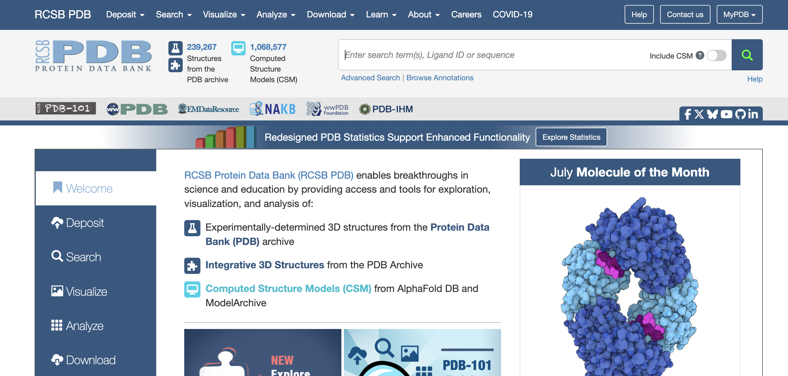
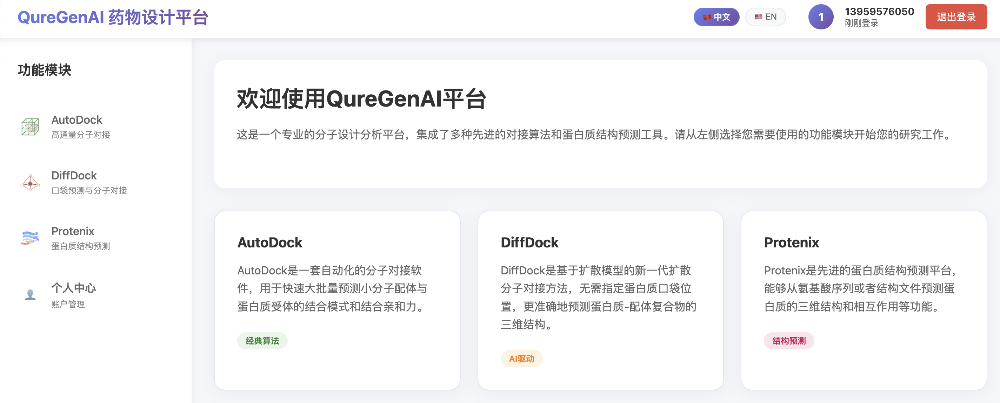
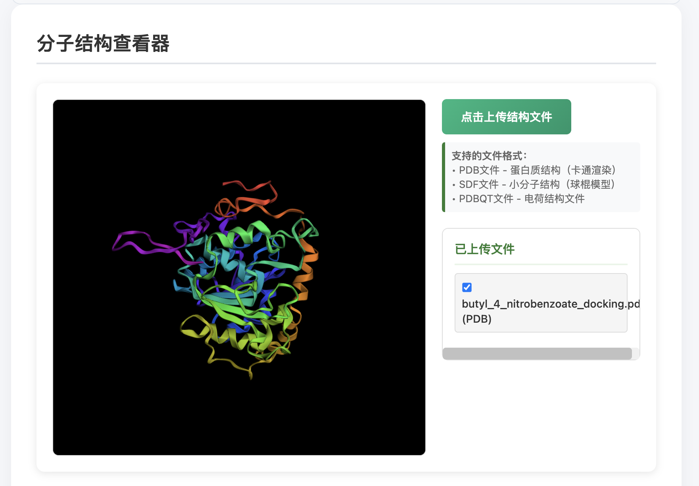
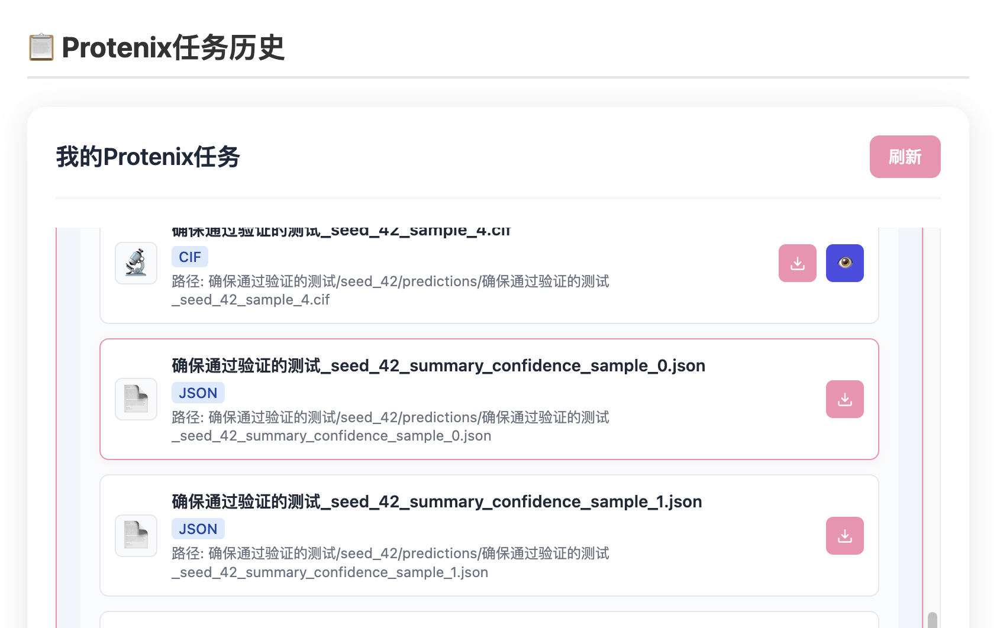
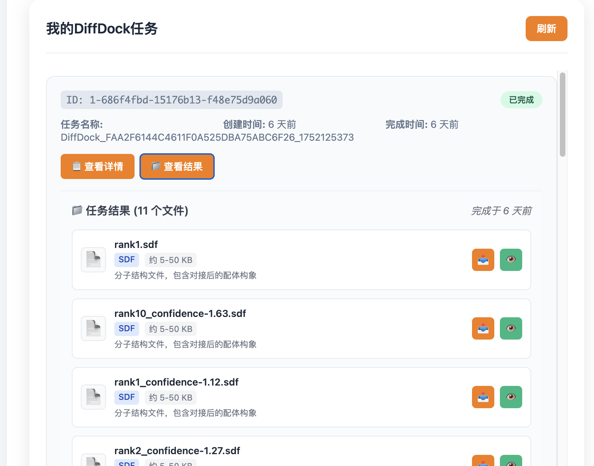
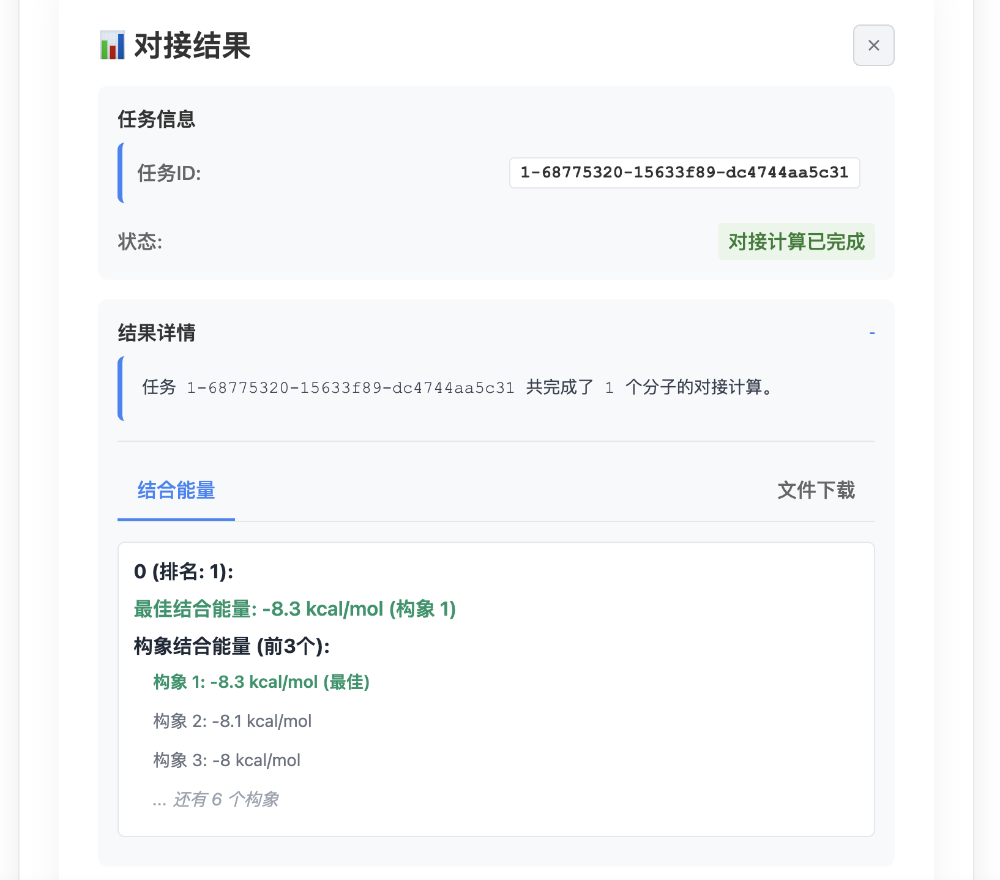

##  I.QureGenAI平台教程：酶柔性耦合

酶柔性耦合（Enzyme Flexible Coupling）是指通过计算模拟研究酶与底物/配体结合时的动态相互作用过程，重点考察酶构象变化对结合亲和力和催化效率的影响。与刚性对接不同，柔性耦合不仅考虑底物的自由度，还模拟酶活性残基（如催化三联体）和结构域（如柔性loop区）的构象调整，更真实地反映生物分子识别的动态特性。

在这一过程中，**蛋白质结构**提供了结合口袋的三维空间信息，其关键残基的质子化状态（如组氨酸的tautomer形式）和侧链取向直接影响底物结合模式。高分辨率的PDB结构（<2.5 Å）能准确呈现活性位点的几何特征，而分子动力学（MD）模拟可进一步预测构象变化。**分子结构**（如底物或抑制剂）的化学特性（SMILES/SDF编码）决定了其与酶的结合方式：氢键供体/受体、疏水基团和立体构型均会影响结合自由能。通过柔性对接（如Induced Fit Docking）或增强采样技术（如Metadynamics），可系统评估酶-底物复合物的动态稳定性，为酶工程改造或药物设计提供理论依据。

### I. 结构准备阶段
#### 1.1 酶结构获取

蛋白质序列是氨基酸的线性排列，可通过UniProt或NCBI获取，如人胰岛素（P01308）。PDB结构则记录蛋白质的三维原子坐标，主要来自X射线晶体学（如T4溶菌酶1L63，分辨率1.7Å）、冷冻电镜或NMR。PDB文件包含原子位置、二级结构（α螺旋/β折叠）及辅因子信息。序列决定结构，而结构决定功能，例如酶活性位点的空间构象直接催化底物反应。用户可通过RCSB PDB数据库按分辨率（≤2.5Å更佳）或R值（衡量结构精度）筛选可靠结构，二者共同用于分子对接、突变分析等研究。

**操作步骤**：  
A. PDB Bank获取pdb三维结构

1. 访问RCSB PDB数据库（[https://www.rcsb.org](https://www.rcsb.org/)）
    
2. 输入酶名称/PDB ID（如"CALB"）
    

B. UniProt获取蛋白质序列（后两步非必需）

1. 通过UniProt ID获取完整序列或名字（如：Candida antarctica）进行搜索
    
2. 可比对PDB缺失区域（尤其柔性loop区）
    
3. 记录EC编号和关键残基注释

#### 1.2 底物结构准备

SMILES（Simplified Molecular Input Line Entry System）和SDF（Structure Data File）是化学信息学中两种重要的分子结构表示格式。SMILES采用ASCII字符串编码分子结构（如"CC(=O)OC1=CC=CC=C1C(=O)O"代表阿司匹林），具有体积小、易解析的特点，适用于快速检索和机器学习；而SDF是包含原子坐标、键连接关系及化学属性的三维结构文件格式，支持多分子存储（如PubChem下载的化合物库），其扩展性强，可附加物化性质、生物活性等数据字段。二者可相互转换（OpenBabel等工具），SMILES适合初步筛选，SDF则用于精确对接计算。在分子对接中，SMILES需经3D构象生成（RDKit等），而SDF可直接用于Autodock等软件，但需注意检查质子化状态和手性。

**操作方案**：  
A. PubChem下载获取

1. 搜索化合物名称/CID
    如： butyl 4 nitrobenzoate/CID67121、 p Nitrophenyl stearate/CID4279087
    
     
2. 下载选项：
    
    - SDF格式：保留3D构象和原子属性
        
    - SMILES：需平台转换为3D结构（需能量最小化）

### II. 分子对接模拟

目前QureGenAI平台目前支持三种对接工具，protenix（简化版）、diffdock和autodock，根据分析需求，下载的酶/底物格式自行进行选择

| 工具       | 适用场景          |
| -------- | ------------- |
| Protenix | 快速筛选序列-smiles |
| DiffDock | 较高精度柔性对接      |
| AutoDock | 已知活性位点的精确对接   |

#### *Protenix*

- ProteinsX 支持输入蛋白质序列和配体的 SMILES 格式，简化了对接过程。它直接从序列和小分子结构生成对接结果，适合快速初筛和初步评估。

#### *DiffDock*

- DiffDock 支持多种文件格式，包括 PDB 格式的蛋白质结构、蛋白质序列、SMILES 格式的小分子以及 SDF 格式的配体。SDF 文件名中包含置信度评分（如 `confidence-XX`），方便用户评估结果。
- 但是，DiffDock 目前仅支持单批次平行对比，不适合横向比较不同批次的对接结果。因此，如果你需要对多个不同的对接结果进行详细比较，不推荐使用 DiffDock。

#### *AutoDock*

- AutoDock 支持 PDB 格式的蛋白质结构和 SDF 格式的配体。用户可以在页面上手动选择对接中心点坐标，提高了操作灵活性和精度。
- 由于其高度可配置性和详细的参数设置，AutoDock 适用于需要精细控制对接过程的情况，特别适合高精度对接和后续的分子动力学模拟。
- 

### III. 结果分析与验证

#### *Protenix*

生成的对接结果以 CIF 格式呈现，用户可以直接通过点击右手边的眼睛按钮进行可视化查看。

推荐查看 对接得分最高的结果`sample_0`，进行对接结果可视化
此外，通过 JSON 文件，查看各个项目的具体得分，便于进一步的定量分析和结果评估。

1. **pLDDT (Predicted Local Distance Difference Test)**:
    
    - **定义**: pLDDT 是一个局部置信度得分，用于衡量蛋白质结构预测中每个残基的局部准确性。它反映了模型在该位置的预测质量。
    - **范围**: 通常在 0 到 100 之间，默认情况下，高分表示更高的置信度和更好的预测质量。
    - **用途**: 常见于 AlphaFold2 等蛋白质结构预测工具中，用于可视化和评估预测结构的每部分的可信度。
2. **pTM (Predicted TM-Score)**:
    
    - **定义**: pTM 是预测的模板建模得分 (Template Modeling Score)，用于评估预测结构与真实结构的整体相似度。
    - **范围**: 通常在 0 到 1 之间，越接近 1 表示预测结构与真实结构越相似。
    - **用途**: 用于评估全局结构的一致性和整体质量。pTM 分数越高，表示预测模型与真实结构越接近。
3. **pGDE (Predicted Global Distance Error)**:
    
    - **定义**: pGDE 是预测的全局距离误差，用于衡量预测结构中的原子对之间的距离误差。
    - **单位**: 通常是埃 (Å)。
    - **用途**: 用于评估预测结构中的全局几何精度。pGDE 分数越低，表示预测模型的几何结构越准确。
通过不同底物的对接得分可以初步筛选底物和酶的耦合效果

#### *DiffDock*
DiffDock 支持多种文件格式，包括 PDB、序列、SMILES 和 SDF。SDF 文件名中包含置信度评分（如 `confidence-XX`），这有助于用户快速评估对接结果的可靠性。

平台DiffDock输出目前仅支持单批次平行对比，不支持不同批次之间的横向比较。因此，若需要对多个批次的对接结果进行详细比较，建议使用本地软件如 PyMOL 进行手动可视化评估。

#### *AutoDock*
AutoDock 在结合能量窗口中显示不同构象的结合能排名，用户可以通过这些排名初步筛选底物与酶的耦合效果。通过比较不同底物的结合能，可以有效评估其与受体的相互作用强度。

AutoDock 的高度可配置性允许用户设置详细的对接参数，并且可以进行精细的对接中心点选择，从而提高对接结果的准确性和可靠性。

### IV. 后续分析

在获得初步的蛋白质-配体对接结果后，可以使用分子动力学（MD）模拟软件如 GROMACS 或 OpenMM 对结果进行更详细的分析。这些工具能够提供更为深入的动态信息，帮助研究者理解蛋白质和配体在真实环境中的行为。

**GROMACS:** GROMACS 是一个广泛使用的分子动力学模拟软件包，适用于生物大分子系统的研究。通过 GROMACS，用户可以设置复杂的模拟条件，包括温度、压力、溶剂模型等，从而在接近生理条件的环境中模拟蛋白质-配体复合物的行为。这有助于揭示蛋白质的柔性变化、构象转换以及配体结合的动态过程。

**OpenMM:** OpenMM 是另一个强大的分子动力学模拟平台，特别适合大规模并行计算。它提供了高效的算法和硬件加速，使得用户能够在较短的时间内完成复杂的模拟任务。OpenMM 也支持多种力场和溶剂模型，确保模拟结果的准确性和可靠性。

本文内容受到了公众号“生物大模型”发布的《AI蛋白质教程：AlphaFold+GROMACS酶柔性与功能耦合分析教程（酯酶实例）》的启发。
该教程详细介绍了如何结合 AlphaFold 预测的蛋白质结构与 GROMACS 进行酶的柔性与功能耦合分析，对我们撰写本教程提供了宝贵的参考和灵感。我们在此表示衷心的感谢。

对于更详细的分子动力学分析内容，我们推荐大家前往公众号“生物大模型”查看《AI蛋白质教程：AlphaFold+GROMACS酶柔性与功能耦合分析教程（酯酶实例）》，以获取更多宝贵的信息和指导。

