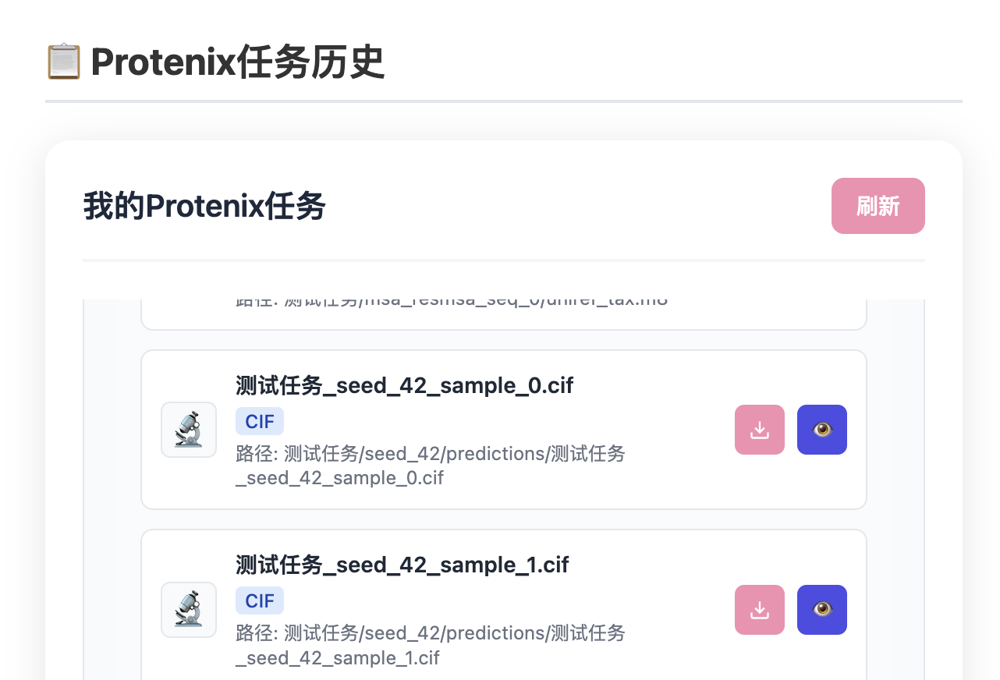

## protenix

### 介绍
Protenix是由**字节跳动AML AI4Science团队**研发的一款AI工具，专注于**蛋白质、配体、离子、DNA及RNA等生物分子**的快速精准三维结构预测。该工具基于**PyTorch深度学习框架**开发，作为**AlphaFold 3的开源替代方案**，在蛋白质结构预测领域展现出强大性能，尤其擅长利用**分子间相互作用信息**提升预测精度。

通过严格的基准测试，Protenix在结构预测准确性方面表现优异，为结构生物学研究、药物设计及分子动力学模拟提供了高效可靠的开源工具。其代码已公开于**GitHub平台**，推动科研社区在计算生物学领域的创新发展。

### 参数调整
通过选择true/false按钮进行调整

##### **1. MSA（多重序列比对）**

- **定义**：MSA 是一种生物信息学方法，通过比对目标蛋白与大量同源序列，找出保守的氨基酸位点和共进化模式。
    
- **在蛋白质对接中的作用**：
    
    - 提供 **共进化信息**，帮助预测蛋白质的接触图（Contact Map），即哪些残基在空间上可能接近。
        
    - 辅助3D结构预测，进而用于蛋白质-蛋白质或蛋白质-配体对接分析。
        
    - 依赖 **同源序列数据库**（如UniRef），计算成本较高，尤其是对于稀有蛋白家族。
        

##### **2. ESM（蛋白质语言模型）**

- **定义**：ESM 是基于 Transformer 的深度学习模型（如 ESM-1b、ESM-2），通过无监督训练从单序列预测蛋白质结构和功能。
    
- **在蛋白质对接中的作用**：
    
    - **替代MSA**：ESM 可以直接从单序列预测残基间的相互作用，无需依赖MSA，大幅降低计算成本。
        
    - **预测接触图**：ESM 的注意力机制可以捕捉长程相互作用，帮助推断蛋白质的折叠方式和潜在结合位点。
        
    - **适用于低同源性蛋白**：即使目标蛋白的同源序列较少，ESM 仍能提供较可靠的预测。

### 输入

可执行蛋白-蛋白对接、蛋白-RNA、蛋白-分子对接，以下为**Protein（蛋白质）、DNA、RNA、Ligand（SMILES格式）** 格式说明

1. Protein（蛋白质）FASTA输入氨基酸序列
2. DNA碱基序列（FASTA）
3. RNA序列（FASTA）
4. SMILES（Simplified Molecular Input Line Entry System），描述分子结构的字符串

### 输出结果
##### cif

分析完毕后，点开任务历史记录，查看详情为模型分析中的参数，在查看结果中可下载对接结果文件，文件格式为cif
**CIF（Crystallographic Information File）** 是一种标准的结构数据格式，常用于存储晶体结构信息（如PDB数据库中的实验结构）

 特点
- **文本格式**：可读性强，支持注释（以`#`开头）。
    
- **基于标签**：数据以`key-value`形式存储（如`_atom_site.Cartn_x`表示原子X坐标）。
    
- **支持多维数据**：可存储结构因子、电子密度等晶体学信息。

对接结果可视化可以通过点击cif文件后的眼睛按钮进行在线可视化查看

##### json
推荐查看 对接得分最高的结果`sample_0`，进行对接结果可视化
此外，通过 JSON 文件，可查看各个项目的具体得分，便于进一步的定量分析和结果评估。

1. **pLDDT (Predicted Local Distance Difference Test)**:
    
    - **定义**: pLDDT 是一个局部置信度得分，用于衡量蛋白质结构预测中每个残基的局部准确性。它反映了模型在该位置的预测质量。
    - **范围**: 通常在 0 到 100 之间，默认情况下，高分表示更高的置信度和更好的预测质量。
    - **用途**: 常见于 AlphaFold2 等蛋白质结构预测工具中，用于可视化和评估预测结构的每部分的可信度。
2. **pTM (Predicted TM-Score)**:
    
    - **定义**: pTM 是预测的模板建模得分 (Template Modeling Score)，用于评估预测结构与真实结构的整体相似度。
    - **范围**: 通常在 0 到 1 之间，越接近 1 表示预测结构与真实结构越相似。
    - **用途**: 用于评估全局结构的一致性和整体质量。pTM 分数越高，表示预测模型与真实结构越接近。
3. **pGDE (Predicted Global Distance Error)**:
    
    - **定义**: pGDE 是预测的全局距离误差，用于衡量预测结构中的原子对之间的距离误差。
    - **单位**: 通常是埃 (Å)。
    - **用途**: 用于评估预测结构中的全局几何精度。pGDE 分数越低，表示预测模型的几何结构越准确。
通过不同底物的对接得分可以初步筛选底物和酶的耦合效果