# 平台教程

## 1.protenix

### 介绍
Protenix是由**AML AI4Science团队**研发的一款AI工具，专注于**蛋白质、配体、离子、DNA及RNA等生物分子**的快速精准三维结构预测。该工具基于**PyTorch深度学习框架**开发，作为**AlphaFold 3的开源替代方案**，在蛋白质结构预测领域展现出强大性能，尤其擅长利用**分子间相互作用信息**提升预测精度。

通过严格的基准测试，Protenix在结构预测准确性方面表现优异，为结构生物学研究、药物设计及分子动力学模拟提供了高效可靠的开源工具。其代码已公开于**GitHub平台**，推动科研社区在计算生物学领域的创新发展。

### 参数调整
通过选择true/false按钮进行调整

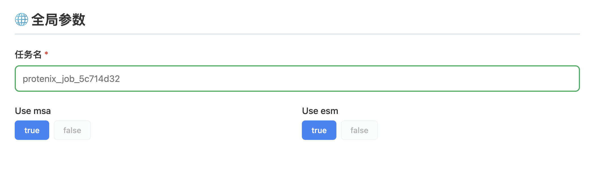
##### **1. MSA（多重序列比对）**

- **定义**：MSA 是一种生物信息学方法，通过比对目标蛋白与大量同源序列，找出保守的氨基酸位点和共进化模式。
    
- **在蛋白质对接中的作用**：
    
    - 提供 **共进化信息**，帮助预测蛋白质的接触图（Contact Map），即哪些残基在空间上可能接近。
        
    - 辅助3D结构预测，进而用于蛋白质-蛋白质或蛋白质-配体对接分析。
        
    - 依赖 **同源序列数据库**（如UniRef），计算成本较高，尤其是对于稀有蛋白家族。
        

##### **2. ESM（蛋白质语言模型）**

- **定义**：ESM 是基于 Transformer 的深度学习模型（如 ESM-1b、ESM-2），通过无监督训练从单序列预测蛋白质结构和功能。
    
- **在蛋白质对接中的作用**：
    
    - **替代MSA**：ESM 可以直接从单序列预测残基间的相互作用，无需依赖MSA，大幅降低计算成本。
        
    - **预测接触图**：ESM 的注意力机制可以捕捉长程相互作用，帮助推断蛋白质的折叠方式和潜在结合位点。
        
    - **适用于低同源性蛋白**：即使目标蛋白的同源序列较少，ESM 仍能提供较可靠的预测。

### 输入
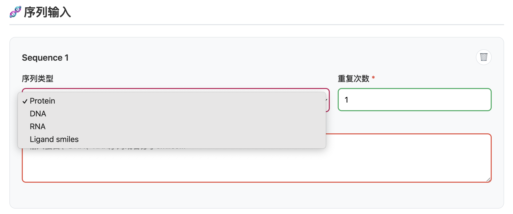

可执行蛋白-蛋白对接、蛋白-RNA、蛋白-分子对接，以下为**Protein（蛋白质）、DNA、RNA、Ligand（SMILES格式）** 格式说明

1. Protein（蛋白质）FASTA输入氨基酸序列
2. DNA碱基序列（FASTA）
3. RNA序列（FASTA）
4. SMILES（Simplified Molecular Input Line Entry System），描述分子结构的字符串

### 输出结果
##### cif
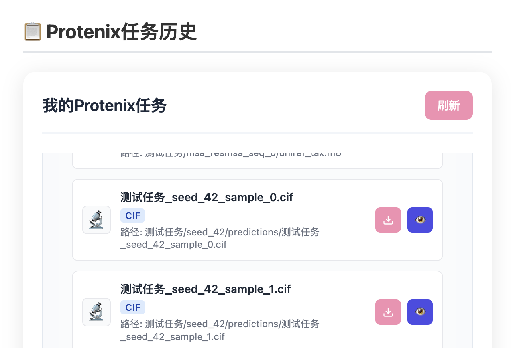

分析完毕后，点开任务历史记录，查看详情为模型分析中的参数，在查看结果中可下载对接结果文件，文件格式为cif
**CIF（Crystallographic Information File）** 是一种标准的结构数据格式，常用于存储晶体结构信息（如PDB数据库中的实验结构）

 特点
- **文本格式**：可读性强，支持注释（以`#`开头）。
    
- **基于标签**：数据以`key-value`形式存储（如`_atom_site.Cartn_x`表示原子X坐标）。
    
- **支持多维数据**：可存储结构因子、电子密度等晶体学信息。

对接结果可视化可以通过点击cif文件后的眼睛按钮进行在线可视化查看

##### json
推荐查看 对接得分最高的结果`sample_0`，进行对接结果可视化
此外，通过 JSON 文件，可查看各个项目的具体得分，便于进一步的定量分析和结果评估。

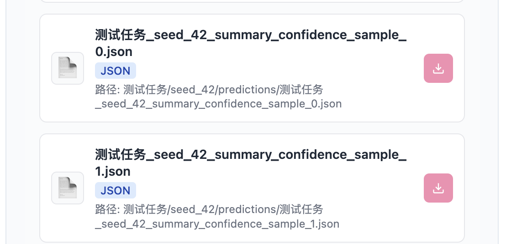

1. **pLDDT (Predicted Local Distance Difference Test)**:
    
    - **定义**: pLDDT 是一个局部置信度得分，用于衡量蛋白质结构预测中每个残基的局部准确性。它反映了模型在该位置的预测质量。
    - **范围**: 通常在 0 到 100 之间，默认情况下，高分表示更高的置信度和更好的预测质量。
    - **用途**: 常见于 AlphaFold2 等蛋白质结构预测工具中，用于可视化和评估预测结构的每部分的可信度。
2. **pTM (Predicted TM-Score)**:
    
    - **定义**: pTM 是预测的模板建模得分 (Template Modeling Score)，用于评估预测结构与真实结构的整体相似度。
    - **范围**: 通常在 0 到 1 之间，越接近 1 表示预测结构与真实结构越相似。
    - **用途**: 用于评估全局结构的一致性和整体质量。pTM 分数越高，表示预测模型与真实结构越接近。
3. **pGDE (Predicted Global Distance Error)**:
    
    - **定义**: pGDE 是预测的全局距离误差，用于衡量预测结构中的原子对之间的距离误差。
    - **单位**: 通常是埃 (Å)。
    - **用途**: 用于评估预测结构中的全局几何精度。pGDE 分数越低，表示预测模型的几何结构越准确。
通过不同底物的对接得分可以初步筛选底物和酶的耦合效果

## 2.diffdock

### 介绍

DiffDock是一种基于扩散模型的革命性分子对接方法，通过先进的生成式AI技术预测小分子配体与蛋白质受体的结合模式。

与传统依赖力场和采样算法的对接工具不同，DiffDock利用扩散模型的强大生成能力，将对接过程转化为从噪声中逐步重建配体三维姿态的概率建模问题。该方法首先生成随机初始构象，然后通过训练好的神经网络逐步去噪，最终输出高精度的结合构象，同时为每个预测提供置信度评分。

DiffDock的创新性在于其能够自然处理蛋白质-配体相互作用中的复杂特性，如蛋白质柔性、诱导契合效应和隐式结合口袋，而无需预先定义搜索空间或依赖经验力场。相比传统方法，DiffDock在对接精度上显著提升，特别是对于困难靶点，其预测结果中高精度构象（RMSD≤2Å）的比例可达60-80%，远超传统方法的30-50%。

此外，DiffDock的计算效率极高，在GPU上可实现秒级预测，支持大规模虚拟筛选。该方法的输出包含多个可能构象及其置信度，用户可根据需求筛选最优结果或分析结合模式的多模态分布。DiffDock的出现为药物发现中的分子对接提供了全新范式，适用于挑战性靶点的先导化合物优化和虚拟筛选研究。

### 输入

#### 蛋白质输入
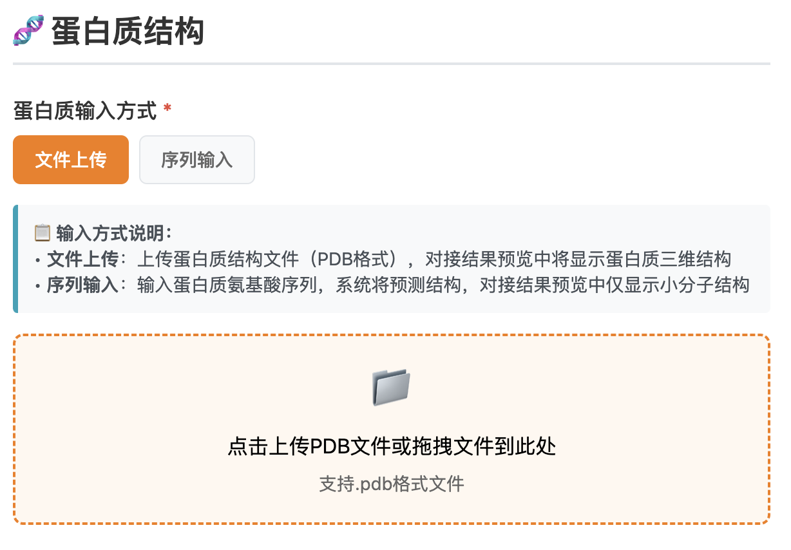
**蛋白质输入格式： PDB**
PDB（Protein Data Bank）格式是存储生物大分子三维结构的标准文本格式，由固定列宽的记录行组成，包含原子坐标、残基信息、二级结构等关键数据。每行以特定关键字（如ATOM、HETATM）开头，记录原子序号、元素类型、残基名称、链标识、三维坐标（X/Y/Z）及温度因子等信息。该格式兼容主流可视化工具（PyMOL、Chimera），但精度受限于列宽限制（坐标保留3位小数）

PDB文件可直接从RCSB数据库下载，是分子对接、结构分析的基础输入格式。

#### 小分子输入

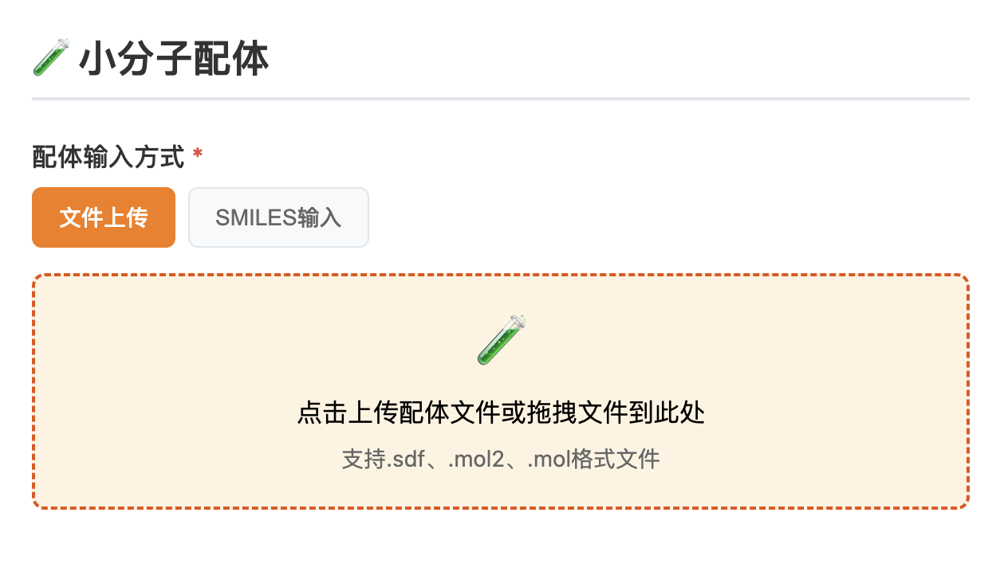
SDF（Structure-Data File）、MOL2（Tripos Mol2）和MOL（MDL Molfile）是化学信息学和分子建模中广泛使用的配体文件格式，它们的来源和发展背景各不相同：

1. **SDF（Structure-Data File）**
    
    - **来源**：由**MDL Information Systems**（现属Biovia/Dassault Systèmes）开发，最初用于其分子建模软件（如ISIS/Draw、Pipeline Pilot）8。
        
    - **特点**：支持存储多个分子结构及自定义属性（如生物活性数据），广泛应用于高通量虚拟筛选和药物数据库（如PubChem、ChEMBL）8。
        
2. **MOL2（Tripos Mol2）**
    
    - **来源**：由**Tripos Associates**（现属Certara）为其**SYBYL**分子建模软件设计，用于存储分子结构、电荷、力场参数等扩展信息36。
        
    - **特点**：采用自由格式ASCII文本，支持复杂分子描述（如蛋白质-配体相互作用），常见于分子动力学模拟（如AMBER、GROMACS）3。
        
3. **MOL（MDL Molfile）**
    
    - **来源**：由**MDL**开发，是早期化学信息学的标准格式，用于单分子结构存储8。
        
    - **特点**：结构简单，仅包含原子、键和基本连接性数据，兼容大多数化学绘图工具（如ChemDraw）
    
4. **SMILES**（Simplified Molecular Input Line Entry System）描述分子结构的字符串

### 参数调整

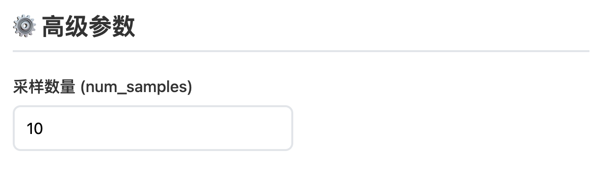

DiffDock中的采样数量（num_samples）是指模型在预测时生成的候选结合构象总数，直接影响结果的全面性和计算效率。增加采样数（如>20）能提高对柔性配体或复杂结合位点的覆盖度，更可能捕获真实构象，但会显著增加计算时间和GPU内存消耗；减少采样数（如<20）可加速预测，适合高通量筛选，但可能遗漏低能态构象。用户可根据靶点灵活性和需求调整，建议结合聚类分析和置信度评分验证采样充分性。

### 输出结果

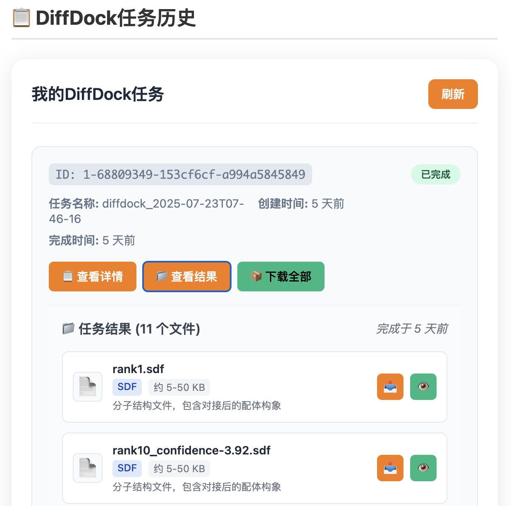

- **Rank（排名）**：表示模型对生成的多个构象按综合质量（如能量评分、几何合理性）进行的排序，**Rank 1**代表当前预测中最佳的结合姿态，数值越小优先级越高。
    
- **Confidence（置信度）**：反映模型对该构象准确性的把握程度（通常基于内部评分或概率），数值通常为负数，数值越低（及负值越大）表示预测可靠性越强，可能更接近真实结合模式。

**sdf**结果为已经对接后的带坐标轴信息的小分子输出结果

## 3.autodock

### 介绍

AutoDock是一款广泛应用于分子对接的开源工具套件，由Scripps研究所开发，主要用于预测小分子配体与生物大分子（如蛋白质）之间的结合模式和亲和力。

其核心算法结合了拉马克遗传算法和半柔性对接策略，支持配体构象搜索和蛋白质侧链柔性调整。AutoDock Vina作为其优化版本，在速度和精度上显著提升，采用梯度优化算法实现高效全局搜索。用户需准备受体（PDBQT格式）和配体文件，通过定义搜索空间生成结合构象及结合自由能评分。该工具广泛应用于药物虚拟筛选和相互作用机制研究。

### 输入

上传文件结构包括：
##### PDB文件（蛋白质结构）
PDB（Protein Data Bank）格式是存储生物大分子三维结构的标准文本格式，由固定列宽的记录行组成，包含原子坐标、残基信息、二级结构等关键数据。每行以特定关键字（如ATOM、HETATM）开头，记录原子序号、元素类型、残基名称、链标识、三维坐标（X/Y/Z）及温度因子等信息。该格式兼容主流可视化工具（PyMOL、Chimera），但精度受限于列宽限制（坐标保留3位小数）

PDB文件可直接从RCSB数据库下载，是分子对接、结构分析的基础输入格式。

##### SDF文件（小分子结构）
SDF（Structure-Data File）是一种化学信息学通用格式，以文本形式存储单/多分子的结构、属性及拓扑信息。每个分子由原子-键列表（如`C 1.0 0.0 0.0`）、连接性（`1 2 1`）及自定义属性（如`> <IC50>`）组成，支持多分子批量存储（通过`$$$$`分隔）。SDF广泛用于药物数据库（如PubChem）和虚拟筛选，其优势在于兼容生物活性数据，但需工具（如OpenBabel）转换为PDBQT等对接专用格式。

##### PDBQT文件
电荷结构文件，包含蛋白质或者小分子结构信息，既可以通过**PDB**文件转化生成，也可以从**SDF**等小分子格式转换得到

PDBQT是AutoDock系列工具专用的分子格式，在PDB基础上扩展了原子电荷（Q）、原子类型（T）及柔性定义。受体PDBQT需保留蛋白质刚性骨架并指定柔性残基（如`REMARK 20 active torsions`），配体PDBQT则需标记可旋转键（`TORSDOF 10`）。该格式通过工具（如MGLTools）从PDB/SDF生成，关键步骤包括：加氢（如`pdbqt_addh`）、计算电荷（如Gasteiger）、删除非极性氢，确保对接时能量评分准确。PDBQT是AutoDock/Vina强制要求的输入格式，平衡了结构精度与计算效率。

##### 坐标选择

可通过在查看器中选择原子进行手动坐标查询及显示，后续可以讲坐标填入对接参数窗口中

### 参数调整

##### 口袋中心坐标

在AutoDock中，口袋中心坐标（Grid Center）用于定义分子对接的搜索空间核心位置，通常以三维直角坐标系（X、Y、Z）表示。这些坐标需精准覆盖目标蛋白的活性位点或已知结合区域，可通过可视化软件（如PyMOL）手动测量或基于参考配体的质心自动计算。

若坐标过于偏离实际结合位点，可能导致对接失败或结果不准确。例如，对HIV-1蛋白酶，中心坐标可能设为关键催化残基（如Asp25）附近。用户需在配置文件（.gpf或Vina的--center参数）中指定位置，确保算法聚焦于相关区域。

##### 对接盒子尺寸

对接盒子尺寸（Grid Box Size）决定了搜索空间的范围，以埃（Å）为单位定义长、宽、高（如20×20×20 Å）。尺寸过小可能遗漏潜在结合位点，过大则增加计算量且降低精度。

一般建议盒子边缘距离配体至少5-10 Å，以容纳构象变化。例如，若配体大小约10 Å，盒子尺寸可设为20×20×20 Å。在柔性对接中，还需考虑蛋白质侧链运动空间。AutoDock Tools或Vina的--size参数可交互式调整盒子，需平衡计算效率与覆盖度。

##### 计算线程数

计算线程数（Number of Threads）控制并行计算资源，直接影响对接速度。AutoDock Vina通过--cpu参数指定（如--cpu 8表示使用8线程），充分利用多核CPU加速搜索。目前平台推荐线程数值：2000-5000

### 输出结果

结合能量窗口中显示不同构象的结合能排名，可以初步筛选底物与酶的耦合效果。通过比较不同底物的结合能，有效评估其与受体的相互作用强度。
结合能单位通常为负值，单位kcal/mol，负值越大结合能越高。通过结合能在下载文件中找到对应的构象并转换为PDB格式

# workshop
如何用qai平台完成分析
bioqc
##  I.酶柔性耦合

酶柔性耦合（Enzyme Flexible Coupling）是指通过计算模拟研究酶与底物/配体结合时的动态相互作用过程，重点考察酶构象变化对结合亲和力和催化效率的影响。与刚性对接不同，柔性耦合不仅考虑底物的自由度，还模拟酶活性残基（如催化三联体）和结构域（如柔性loop区）的构象调整，更真实地反映生物分子识别的动态特性。

在这一过程中，**蛋白质结构**提供了结合口袋的三维空间信息，其关键残基的质子化状态（如组氨酸的tautomer形式）和侧链取向直接影响底物结合模式。高分辨率的PDB结构（<2.5 Å）能准确呈现活性位点的几何特征，而分子动力学（MD）模拟可进一步预测构象变化。**分子结构**（如底物或抑制剂）的化学特性（SMILES/SDF编码）决定了其与酶的结合方式：氢键供体/受体、疏水基团和立体构型均会影响结合自由能。通过柔性对接（如Induced Fit Docking）或增强采样技术（如Metadynamics），可系统评估酶-底物复合物的动态稳定性，为酶工程改造或药物设计提供理论依据。

### I. 结构准备阶段
#### 1.1 酶结构获取

蛋白质序列是氨基酸的线性排列，可通过UniProt或NCBI获取，如人胰岛素（P01308）。PDB结构则记录蛋白质的三维原子坐标，主要来自X射线晶体学（如T4溶菌酶1L63，分辨率1.7Å）、冷冻电镜或NMR。PDB文件包含原子位置、二级结构（α螺旋/β折叠）及辅因子信息。序列决定结构，而结构决定功能，例如酶活性位点的空间构象直接催化底物反应。用户可通过RCSB PDB数据库按分辨率（≤2.5Å更佳）或R值（衡量结构精度）筛选可靠结构，二者共同用于分子对接、突变分析等研究。

**操作步骤**：  
A. PDB Bank获取pdb三维结构

1. 访问RCSB PDB数据库（[https://www.rcsb.org](https://www.rcsb.org/)）
    
2. 输入酶名称/PDB ID（如"CALB"）
    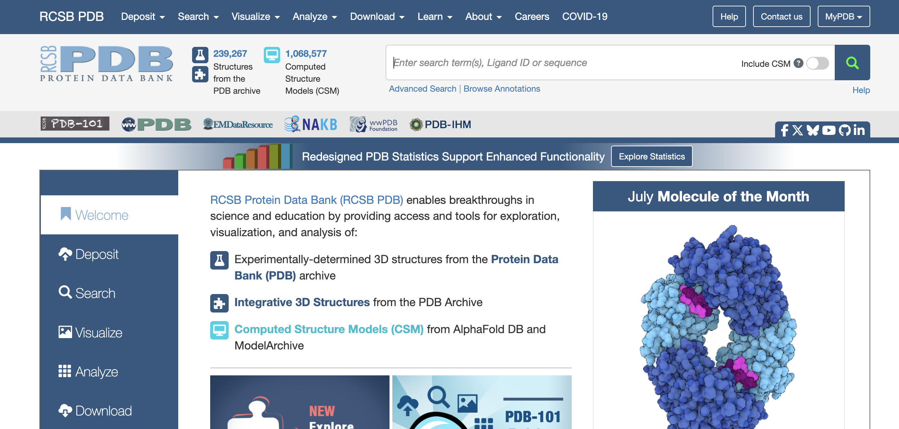

B. UniProt获取蛋白质序列（后两步非必需）
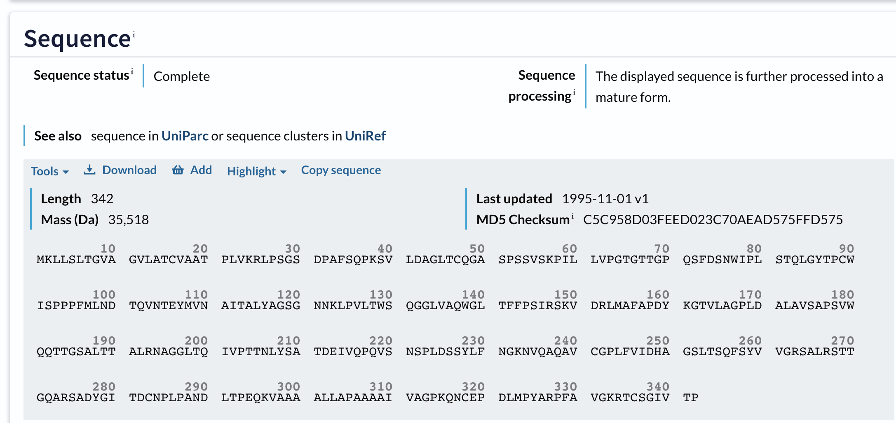

1. 通过UniProt ID获取完整序列或名字（如：Candida antarctica）进行搜索
    
2. 可比对PDB缺失区域（尤其柔性loop区）
    
3. 记录EC编号和关键残基注释

#### 1.2 底物结构准备

SMILES（Simplified Molecular Input Line Entry System）和SDF（Structure Data File）是化学信息学中两种重要的分子结构表示格式。SMILES采用ASCII字符串编码分子结构（如"CC(=O)OC1=CC=CC=C1C(=O)O"代表阿司匹林），具有体积小、易解析的特点，适用于快速检索和机器学习；而SDF是包含原子坐标、键连接关系及化学属性的三维结构文件格式，支持多分子存储（如PubChem下载的化合物库），其扩展性强，可附加物化性质、生物活性等数据字段。二者可相互转换（OpenBabel等工具），SMILES适合初步筛选，SDF则用于精确对接计算。在分子对接中，SMILES需经3D构象生成（RDKit等），而SDF可直接用于Autodock等软件，但需注意检查质子化状态和手性。

**操作方案**：  
A. PubChem下载获取
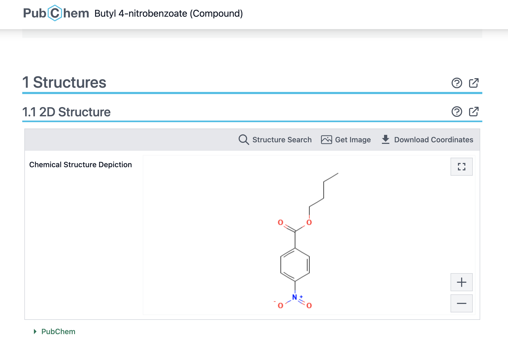

1. 搜索化合物名称/CID
    如： butyl 4 nitrobenzoate/CID67121、 p Nitrophenyl stearate/CID4279087
    
     
2. 下载选项：
    
    - SDF格式：保留3D构象和原子属性
        
    - SMILES：需平台转换为3D结构（需能量最小化）

### II. 分子对接模拟

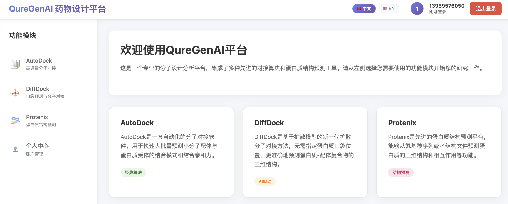
目前QureGenAI平台目前支持三种对接工具，protenix（简化版）、diffdock和autodock，根据分析需求，下载的酶/底物格式自行进行选择

| 工具       | 适用场景          |
| -------- | ------------- |
| Protenix | 快速筛选序列-smiles |
| DiffDock | 较高精度柔性对接      |
| AutoDock | 已知活性位点的精确对接   |

#### *Protenix*

- ProteinsX 支持输入蛋白质序列和配体的 SMILES 格式，简化了对接过程。它直接从序列和小分子结构生成对接结果，适合快速初筛和初步评估。

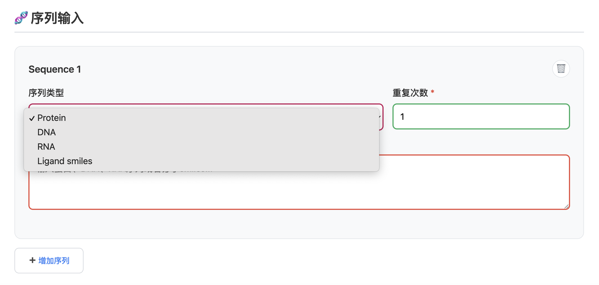

#### *DiffDock*

- DiffDock 支持多种文件格式，包括 PDB 格式的蛋白质结构、蛋白质序列、SMILES 格式的小分子以及 SDF 格式的配体。SDF 文件名中包含置信度评分（如 `confidence-XX`），方便用户评估结果。
- 但是，DiffDock 目前仅支持单批次平行对比，不适合横向比较不同批次的对接结果。因此，如果你需要对多个不同的对接结果进行详细比较，不推荐使用 DiffDock。

#### *AutoDock*

- AutoDock 支持 PDB 格式的蛋白质结构和 SDF 格式的配体。用户可以在页面上手动选择对接中心点坐标，提高了操作灵活性和精度。
- 由于其高度可配置性和详细的参数设置，AutoDock 适用于需要精细控制对接过程的情况，特别适合高精度对接和后续的分子动力学模拟。
- 
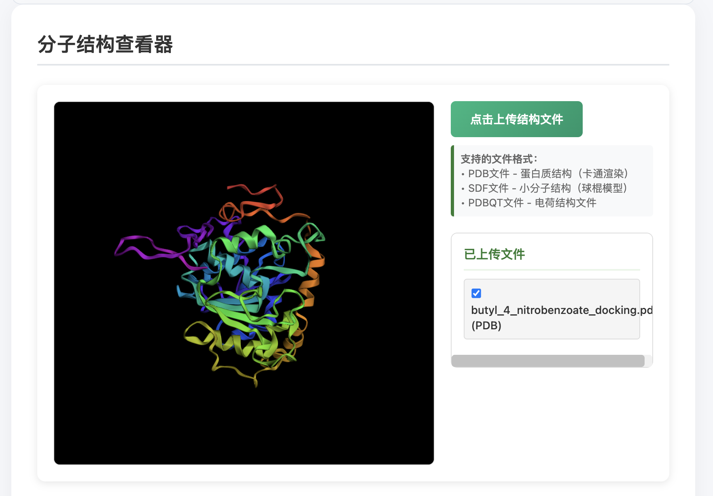

### III. 结果分析与验证

#### *Protenix*

生成的对接结果以 CIF 格式呈现，用户可以直接通过点击右手边的眼睛按钮进行可视化查看。

推荐查看 对接得分最高的结果`sample_0`，进行对接结果可视化
此外，通过 JSON 文件，查看各个项目的具体得分，便于进一步的定量分析和结果评估。

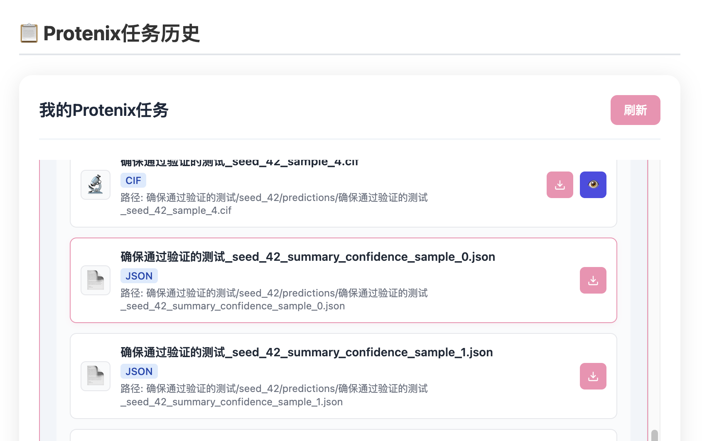
1. **pLDDT (Predicted Local Distance Difference Test)**:
    
    - **定义**: pLDDT 是一个局部置信度得分，用于衡量蛋白质结构预测中每个残基的局部准确性。它反映了模型在该位置的预测质量。
    - **范围**: 通常在 0 到 100 之间，默认情况下，高分表示更高的置信度和更好的预测质量。
    - **用途**: 常见于 AlphaFold2 等蛋白质结构预测工具中，用于可视化和评估预测结构的每部分的可信度。
2. **pTM (Predicted TM-Score)**:
    
    - **定义**: pTM 是预测的模板建模得分 (Template Modeling Score)，用于评估预测结构与真实结构的整体相似度。
    - **范围**: 通常在 0 到 1 之间，越接近 1 表示预测结构与真实结构越相似。
    - **用途**: 用于评估全局结构的一致性和整体质量。pTM 分数越高，表示预测模型与真实结构越接近。
3. **pGDE (Predicted Global Distance Error)**:
    
    - **定义**: pGDE 是预测的全局距离误差，用于衡量预测结构中的原子对之间的距离误差。
    - **单位**: 通常是埃 (Å)。
    - **用途**: 用于评估预测结构中的全局几何精度。pGDE 分数越低，表示预测模型的几何结构越准确。
通过不同底物的对接得分可以初步筛选底物和酶的耦合效果

#### *DiffDock*
DiffDock 支持多种文件格式，包括 PDB、序列、SMILES 和 SDF。SDF 文件名中包含置信度评分（如 `confidence-XX`），这有助于用户快速评估对接结果的可靠性。

平台DiffDock输出目前仅支持单批次平行对比，不支持不同批次之间的横向比较。因此，若需要对多个批次的对接结果进行详细比较，建议使用本地软件如 PyMOL 进行手动可视化评估。

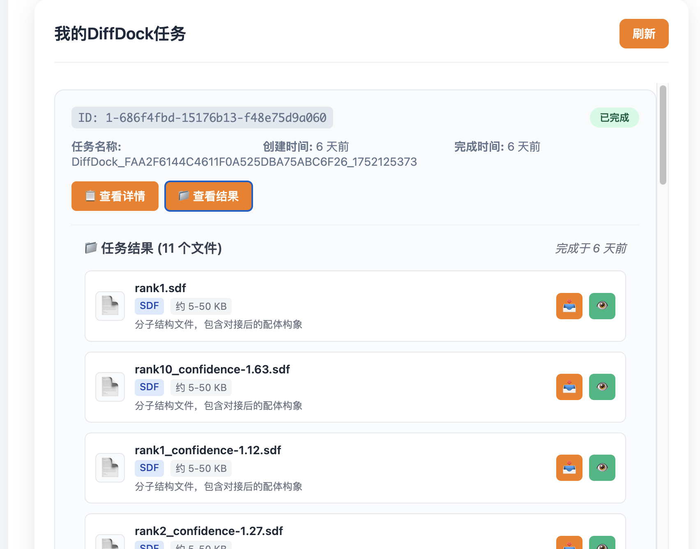

#### *AutoDock*
AutoDock 在结合能量窗口中显示不同构象的结合能排名，用户可以通过这些排名初步筛选底物与酶的耦合效果。通过比较不同底物的结合能，可以有效评估其与受体的相互作用强度。

AutoDock 的高度可配置性允许用户设置详细的对接参数，并且可以进行精细的对接中心点选择，从而提高对接结果的准确性和可靠性。

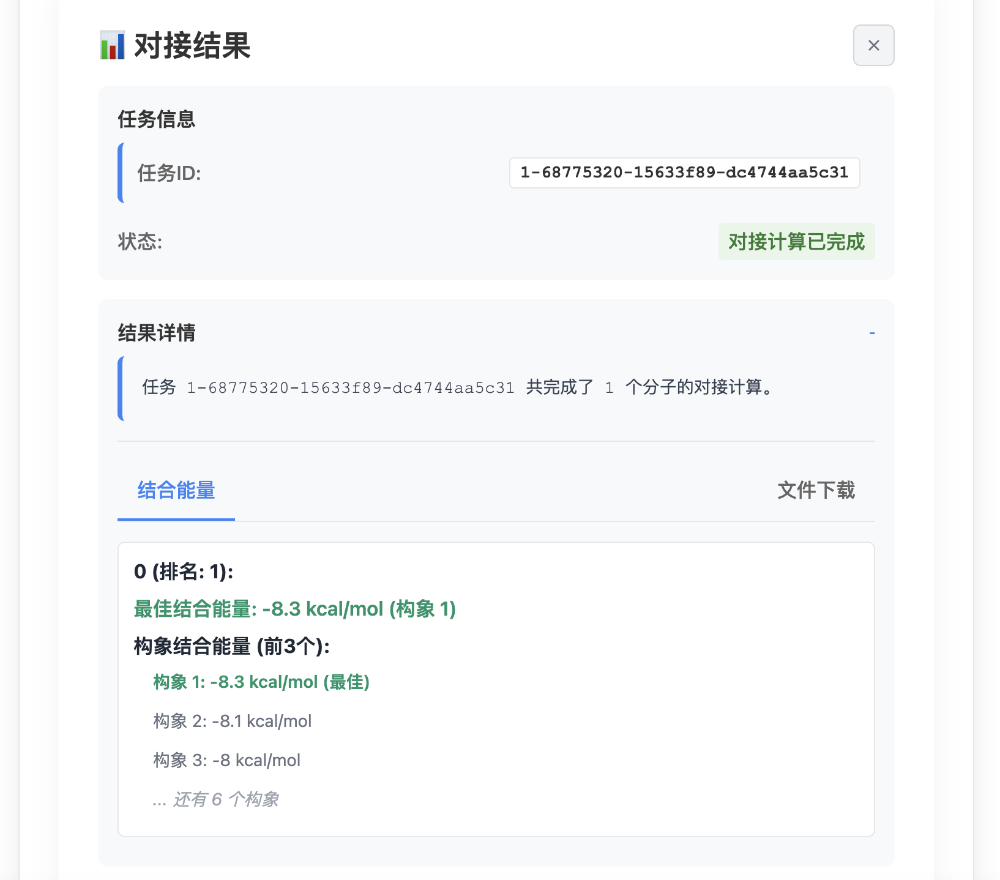

### IV. 后续分析

在获得初步的蛋白质-配体对接结果后，可以使用分子动力学（MD）模拟软件如 GROMACS 或 OpenMM 对结果进行更详细的分析。这些工具能够提供更为深入的动态信息，帮助研究者理解蛋白质和配体在真实环境中的行为。

**GROMACS:** GROMACS 是一个广泛使用的分子动力学模拟软件包，适用于生物大分子系统的研究。通过 GROMACS，用户可以设置复杂的模拟条件，包括温度、压力、溶剂模型等，从而在接近生理条件的环境中模拟蛋白质-配体复合物的行为。这有助于揭示蛋白质的柔性变化、构象转换以及配体结合的动态过程。

**OpenMM:** OpenMM 是另一个强大的分子动力学模拟平台，特别适合大规模并行计算。它提供了高效的算法和硬件加速，使得用户能够在较短的时间内完成复杂的模拟任务。OpenMM 也支持多种力场和溶剂模型，确保模拟结果的准确性和可靠性。

本文内容受到了公众号“生物大模型”发布的《AI蛋白质教程：AlphaFold+GROMACS酶柔性与功能耦合分析教程（酯酶实例）》的启发。
该教程详细介绍了如何结合 AlphaFold 预测的蛋白质结构与 GROMACS 进行酶的柔性与功能耦合分析，对我们撰写本教程提供了宝贵的参考和灵感。我们在此表示衷心的感谢。

对于更详细的分子动力学分析内容，我们推荐大家前往公众号“生物大模型”查看《AI蛋白质教程：AlphaFold+GROMACS酶柔性与功能耦合分析教程（酯酶实例）》，以获取更多宝贵的信息和指导。

###  大纲

I.准备酶和底物结构
酶
1.pdbbank直接下载pdb格式
2.Uniprot获取序列
底物
pubchem下载sdf格式或者smiles

II.模拟对接
目前QureGenAI支持三种对接工具，protenix（简化版）、diffdock和autodock，大家可以根据下载的酶/底物格式自行进行选择
1.protenix直接对接
protenix支持输入序列和smiles
2.diffdock
pdb，序列
smiles，sdf
支持的文件格式比较多，sdf文件名confidence-XX为置信度评分，但是结果得分目前仅支持单批次平行对比
因此如果需要横向对比不同的对接结果不推荐使用该选项
3.autodock
pdb，sdf
可在页面手动选择对接中心点坐标，可操作性更强

III.初步结果评估
1.protenix
cif格式为对接结果，可以直接点开右手边的眼睛按钮，直接可视化查看
推荐查看sample_0，sample_0为对接得分最高的结果
json文件内记录的是各项目具体得分
1. **pLDDT (Predicted Local Distance Difference Test)**:
    
    - **定义**: pLDDT 是一个局部置信度得分，用于衡量蛋白质结构预测中每个残基的局部准确性。它反映了模型在该位置的预测质量。
    - **范围**: 通常在 0 到 100 之间，默认情况下，高分表示更高的置信度和更好的预测质量。
    - **用途**: 常见于 AlphaFold2 等蛋白质结构预测工具中，用于可视化和评估预测结构的每部分的可信度。
2. **pTM (Predicted TM-Score)**:
    
    - **定义**: pTM 是预测的模板建模得分 (Template Modeling Score)，用于评估预测结构与真实结构的整体相似度。
    - **范围**: 通常在 0 到 1 之间，越接近 1 表示预测结构与真实结构越相似。
    - **用途**: 用于评估全局结构的一致性和整体质量。pTM 分数越高，表示预测模型与真实结构越接近。
3. **pGDE (Predicted Global Distance Error)**:
    
    - **定义**: pGDE 是预测的全局距离误差，用于衡量预测结构中的原子对之间的距离误差。
    - **单位**: 通常是埃 (Å)。
    - **用途**: 用于评估预测结构中的全局几何精度。pGDE 分数越低，表示预测模型的几何结构越准确。
通过不同底物的对接得分可以初步筛选底物和酶的耦合效果

2.diffdock
支持的文件格式比较多，sdf文件名confidence-XX为置信度评分，但是结果得分目前仅支持单批次平行对比
不同批次对接结果目前仍需要手动输入本地软件如pymol等进行可视化评估

3.autodock
在结合能量窗口，查看不同构象结合能排名
可通过不同底物的结合能，初步筛选底物和酶的耦合效果

后续
可以使用gromacs或openmm分子动力学模拟对结果进行进一步详细

